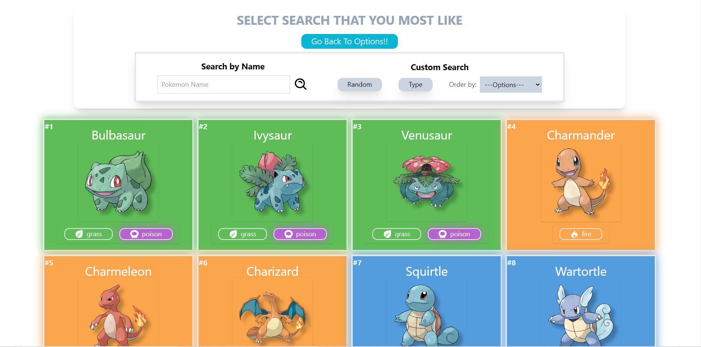

# POKEDEX APP

 This project was built using react js and tailwind js. 
    I'm junior web developer looking for improve my skills to get a nice job.
    I hope you enjoy my project!!

* Live: <a href="https://jhonaquejadau.github.io/pokedex-app/">jhonaquejadau.github.io/pokedex-app</a>

# Screenshots

Let's take a overview about the project and it's features.

### `Home Page`

### `Pokedex Options`

### `Pokedex`
* Pokedex

* Use type slider to filter pokemons

* Use input to search pokemon by name 

### `Pokemon Information`

### `Pokemon Random Page`

### `Mobile Version`

&nbsp;&nbsp;&nbsp;&nbsp;
&nbsp;&nbsp;&nbsp;&nbsp;
&nbsp;&nbsp;&nbsp;&nbsp;

&nbsp;&nbsp;&nbsp;&nbsp;
&nbsp;&nbsp;&nbsp;&nbsp;

# Versions

**v1.4**
* Update pokedex with gen 905 pokemons.
* Context API.
* Cleaned code.
* Animations in home page.
* Full repsonsive design (All devices).
* Evolutions bug fixed.
* Rerender fixed.
* New pokeballs loading data.
* Options pages added.
* New pokedex type added (Pokedex Random).

**v1.2**
* Update pokedex with 700 pokemons.
* Evolutions and weakness implemented.
* Mobile version responsive design fixed.
* Header, and footer component deleted.
* New home page added.

**v1.0**
* 500 Pokemon fetch without (Weakness, Evolutions, Stats).
* Search component options to order pokemons cards, filter by type and search pokemons by name.
* Full desktop responsive design.
* Mobile responsive design (BETA).
* Switching pages with boolean values. 

# Getting Started:

**Repository : [jhonaquejadau](https://github.com/jhonaquejadau/pokedex-app)**

# Credits
Thanks to [PokéAPI.co](https://github.com/PokeAPI/pokeapi) for the awesome API. [duiker101](https://github.com/duiker101/pokemon-type-svg-icons) for cute icons. [Pokemon Company](https://www.pokemon.com/el/) for hard work dedicated in creating one of the most popular games in history.

# Copyright Note
This is a personal project, non-commercial. This project is jut for improve my skills using react js, taileind js, fetching API and more. This is a fan-made app. Therefore, I appreciated if you can share with your friends and give me a like in my repository. Just enjoy the applications.
